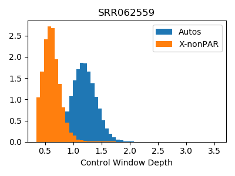
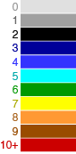

# fastCN

A pipeline for the fast estimation of copy-number based on read depth using
the multi-mapper mrsFAST.

If you are interested in generating paralog specific copy-number estimates
consider QuicK-mer2, accessible at: https://github.com/KiddLab/QuicK-mer2

The basic functionality of fastCN is described in [fastCN-README.txt](fastCN-README.txt)


For more information, and to reference the algorithm, please cite [our paper](https://bmcbiol.biomedcentral.com/articles/10.1186/s12915-018-0535-2) :


Pendleton AL, Shen F, Taravella AM, Emery S, Veeramah KR, Boyko AR, Kidd JM.
Comparison of village dog and wolf genomes highlights the role of the neural
crest in dog domestication. BMC Biol. 2018 Jun 28;16(1):64. doi: 10.1186/s12915-018-0535-2. PMID:29950181

# Tutorial for setting up and testing the fastCN pipeline.

Requirements:
python3, various standard python modules, g++, mrsfast, samtools

## Step 1 Download and compile fastCN core programs

Setup a directory to download and work from.  Clone the repository and compile the required core program components.
There may be some compiler warnings.

```
git clone https://github.com/KiddLab/fastCN.git 

cd fastCN
g++ -o GC_control_gen GC_control_gen.cc 
g++ -o SAM_GC_correction SAM_GC_correction.cc 
```

The fastCN directory needs to be in your path so that the correction script can find required
utilities. You can add the directory to your path temporarily using 

```
export PATH=$PWD:$PATH
```

## Step 2 Download prebuilt reference files and masked genome bed file

Pre-computed masking information is available for some commonly used reference genes in https://kiddlabshare.med.umich.edu/fastCN-references/

For this tutorial we will use a version of the human GRCh38 genome assembly. 

Download it to a directory and unpack it. First, change you directory to be outside of the fastCN git repository. Then:

```
wget https://kiddlabshare.med.umich.edu/fastCN-references/GRCh38_BSM_WMDUST.tar.gz
tar -xvzf GRCh38_BSM_WMDUST.tar.gz
rm GRCh38_BSM_WMDUST.tgz
```

This directory contains several files to use with the fastCN pipeline.  The genome reference
is a version of GRCh38 that does not include alternative or HLA haplotypes.  Masking has occurred
already for regions identified by RepeatMasker, TRF, WMDUST, and overrepresented 50mers.

There are three directories.

`GRCh38_BSM_WMDUST/ref-WMDUST` contains files describing the genome masking. This includes an unmasked 
version of the reference, a file giving the masking locations plus 36bp flanks, and a bed file of regions
to exclude during normalization.

`GRCh38_BSM_WMDUST/ref-WMDUST-masked/` contains the genome reference with repeated segments masked out.
Mapping will occur against this version, otherwise a large number of alignments to repeats will occur.

`GRCh38_BSM_WMDUST/windows-WMDUST/` contains several files needed for normalization and processing.
Included are windows containing 1kb and 3kb of masked sequence, as well as regions that are not used in
copy-number correction.

## Step 3 Setup fastCN GC-normalization files

The basic command layout is:
```./GC_control_gen Original_genome.fa Excluded.bed Masked.bed 400 genome_GC.bin```

The 400 indicates a window size of 400 bp for determining GC percentage for normalization.
The command will create a file GRCh38_BSM_WMDUST/ref/GRCh38_BSM_WMDUST.GC_control.bin


Sample cmd:
```
fastCN/GC_control_gen \
GRCh38_BSM_WMDUST/ref-WMDUST/GRCh38_BSM_WMDUST_unmasked.fa \
GRCh38_BSM_WMDUST/ref-WMDUST/GRCh38_BSM_WMDUST.exclude.bed.sort2 \
GRCh38_BSM_WMDUST/ref-WMDUST/GRCh38_BSM_WMDUST.gaps.bed.slop36.sorted.merged.sort2 \
400 \
GRCh38_BSM_WMDUST/ref-WMDUST/GRCh38_BSM_WMDUST.GC_control.bin
```

Note that the file GRCh38_BSM_WMDUST/ref/GRCh38_BSM.fa is the unmasked genome. This way
GC values in repeats are considered properly.

## Step 4 Build mrsfast index for mapping
We have tested with mrsfast v. 3.3.9, but newer versions will work as well. 
An index should be build from the masked genome.

```
cd GRCh38_BSM_WMDUST/ref-WMDUST-masked/
mrsfast --index GRCh38_BSM_WMDUST_masked.fa
```


## Step 5 Download a small fastq set from 1000 Genomes for testing

```
cd ..
mkdir fastq
cd fastq
wget ftp://ftp.sra.ebi.ac.uk/vol1/fastq/SRR062/SRR062559/SRR062559_1.fastq.gz
wget ftp://ftp.sra.ebi.ac.uk/vol1/fastq/SRR062/SRR062559/SRR062559_2.fastq.gz
```

## Step 6 Mapping
Now we are ready to do the mapping and postprocessing.  Here, we'll break it down
into individual steps. Steps can be easily combined with a Python or other driver
script to streamline the procedure for multiple samples.  If you have multiple libraries/runs/lanes
for a sample, it is best to run them separately and then combine the GC normalized depth files. Other scripts
in the repository can be used to combine the files.

Here, we will split the reads into 36bp chunks and map them to the masked
reference genome using mrsfast.  Other python scripts included can be used to process
BAM files.  This example uses 8 threads and 16G of memory in the mrsfast step.

```
cd ..
mkdir mapping

python fastCN/extract-from-fastq36-pair.py --in1 fastq/SRR062559_1.fastq.gz --in2 fastq/SRR062559_2.fastq.gz  |  \
mrsfast --search GRCh38_BSM_WMDUST/ref-WMDUST-masked/GRCh38_BSM_WMDUST_masked.fa \
 --seq /dev/fd/0 --disable-nohits --mem 16 --threads 8 -e 2 --outcomp -o mapping/SRR062559
```

This will make the file `mapping/SRR062559.sam.gz`

Here is the final output of mrsFAST for the command we ran:

```
Total Time:                      3251.35
Total No. of Reads:            101010744
Total No. of Mappings:          36734287
```


## Step 7 Perform GC correction and make per-bp depth file.

The GC correction step uses a python utility `smooth_GC_mrsfast.py` for curve fitting. 
Check that this program is found in your path:
```
which smooth_GC_mrsfast.py
```

Then make a directory for output and execute  `SAM_GC_correction`:

```
mkdir binary
zcat mapping/SRR062559.sam.gz | \
fastCN/SAM_GC_correction  \
GRCh38_BSM_WMDUST/ref-WMDUST/GRCh38_BSM_WMDUST_unmasked.fa.fai \
GRCh38_BSM_WMDUST/ref-WMDUST/GRCh38_BSM_WMDUST.GC_control.bin \
/dev/fd/0 \
binary/SRR062559
```

The resulting binary depth file should be gziped for future processing and to make files smaller and 

`gzip binary/SRR062559.bin`

This should also make a plot of the depth vs GC and a curve of correction factors used. In the example,
there is a mean depth of ~1.25 and a smooth correction curve.

Here is a sample image


## Step 8: Convert per bp corrected depth to depth in windows
The file binary/SRR062559.bin.gz is a half-float representation of the per-bp  GC corrected depth.
We can convert to mean values in 3kb windows using the associated python script.

```
mkdir windows

python fastCN/perbp-to-windows.py \
--depth binary/SRR062559.bin.gz \
--out windows/SRR062559.depth.3kb.bed \
--chromlen GRCh38_BSM_WMDUST/ref-WMDUST/GRCh38_BSM_WMDUST_unmasked.fa.fai \
--windows GRCh38_BSM_WMDUST/windows-WMDUST/GRCh38_BSM_WMDUST.3kb.bed
```

## Step 9 convert windows of depth to windows of copy-number based on defined control regions

```
python fastCN/depth-to-cn.py \
--in windows/SRR062559.depth.3kb.bed \
--autocontrol GRCh38_BSM_WMDUST/windows-WMDUST/GRCh38_BSM_WMDUST.3kb.autoControl.bed \
--chrX GRCh38_BSM_WMDUST/windows-WMDUST/GRCh38_BSM_WMDUST.3kb.chrXnonParControl.bed
```

The file windows/SRR062559.depth.3kb.bed.CN.bed has per window estimated copy numbers
windows/SRR062559.depth.3kb.bed.stats has the mean and std depth for autosomes and X.
The two png files show the distributions.




# Other information and FAQs

Sample output is given in the 'sample-out' directory of this repository.
Other potentially useful scripts are included in the 'other-scripts' directory.

### How to make other sizes of windows
Check out `make-equal-windows.py`  This program allows you to make windows of any size. Each window
will contain the same number of unmasked bp.

### How to make a bedgraph track for display on the UCSC genome browser
The refernce we aligned to includes some sequences that are not part of the UCSC genome browser release.  These should be removed.
Then, the bedGraphToBigWig program can be used to make a file for display.

```
grep -v '_decoy' SRR062559.depth.3kb.bed.CN.bed | grep -v 'chrEBV'  > SRR062559.3kb.CN.sel.bed

bedGraphToBigWig   SRR062559.3kb.CN.sel.bed \
hg38/hg38.chrom.sizes \
SRR062559.3kb.CN.sel.bw
```
The chrom.sizes file matches the actual chromosomes in the UCSC browser.  The .bw track
can be loaded to a custom trackhub or as a custom track

### How to make a heat map bred track

Start with the normalized copy number file corresponding to the chromosomes in the UCSC browser 

Then make heat map track with:
```
python fastCN/other-scripts/make-colortrack-fordisplay.py  --cn windows/SRR062559.3kb.CN.sel.bed --name SRR062559
bedToBigBed -type=bed9 NA12878.3kb.CN.sel.bed-color hg38/hg38.chrom.sizes NA12878.3kb.col.bb
 ```
This makes a file NA12878.3kb.CN.sel.bed.bedColor that can be converted to bigbed and loaded.
Note that if you are zoomed out too far you will just see black instead of the appropriate colors.

The color key is:



### How did you make the exclusion file?

This file contains regions that likely to be copy number variable.  They are ignored
when performing the GC normalization and when converting from depth to copy number.

Here is the exclusion file we used contains DGV variants from these studies indicated below
accessed from http://dgv.tcag.ca/dgv/docs/GRCh38_hg38_variants_2016-05-15.txt

regions were taken from studies:
```
 20492 1000_Genomes_Consortium_Phase_1
  42585 1000_Genomes_Consortium_Phase_3
   8418 Conrad_et_al_2009
   1307 McCarroll_et_al_2008
  11600 Sudmant_et_al_2013
```

Only the CNV regions were taken, not mobile element insertions, inversions, or other variants.

We also included the regions of segmental duplication in the assembly from the SegDup track on UCSC.

The windows used for copy number conversion were found using bed tools intersectBed command.

### Which Python version?
Originally, the fastCN approach used help scripts and conversion utilities written in python2.  
We have since converted the scripts to python3.  The older python2 scripts can be found in the
other-scripts/old-python2-versions/ directory.

### Do I need all the short unplaced contigs?
No, not really for most things.  Along with decoy sequences, they are included to have a common reference across
projects.  The many short contigs slow down the mrsFAST step.  You can remove them, but all of the index/control files
should be regenerated with a consistent chromosome set.


